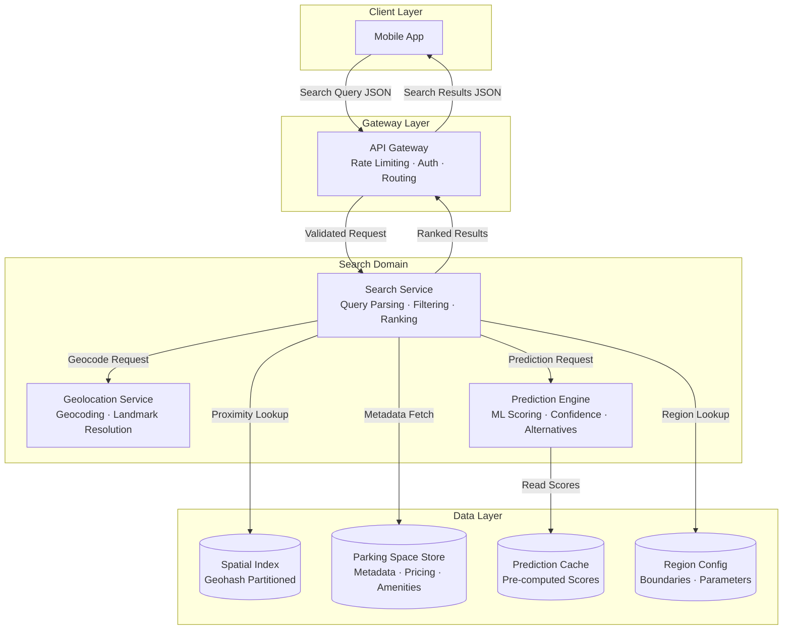
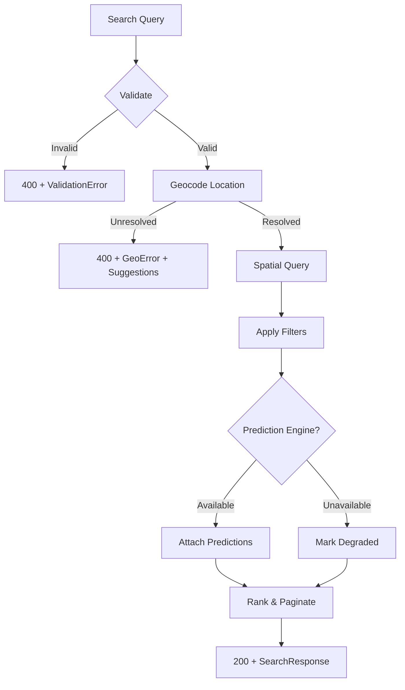

# Design Document: Smart Parking Search

## Overview

Smart Parking Search is the core driver-facing search capability for Parkly. It allows drivers to discover available parking spaces through a combination of location-based queries, time constraints, vehicle/amenity filters, and AI-powered availability predictions. The system is designed as a set of collaborating microservices following Parkly's API-first, mobile-first architecture.

**Key design goals:**

- Sub-2-second response times under normal load (100 concurrent requests/sec)
- Geospatial indexing that scales to 1,000,000 spaces per region without degradation
- AI prediction layer that enriches results with probability, confidence, and alternatives
- Multi-region scalability with no city-specific logic in the search pipeline
- Graceful degradation when the Prediction Engine is unavailable
- Round-trip fidelity for Search_Query JSON serialization/deserialization

**Design decisions rationale:**

| Decision | Rationale |
|----------|-----------|
| Geohash-based spatial indexing | Enables prefix-based proximity lookups, easy region partitioning, and cross-boundary queries by including adjacent geohash cells |
| Pre-computed prediction scores with real-time refresh | Balances latency (avoid synchronous ML inference per request) with accuracy (periodic model scoring) |
| Composite ranking score | Meets requirement for distance + availability as primary factors, price + confidence as secondary |
| Configurable region parameters | Satisfies scalability requirement — new cities added via config, not code |
| Single response format for Map/List views | Eliminates redundant API calls when drivers toggle views |

## Architecture

The Smart Parking Search system is composed of three primary services and two supporting services:



### Request Flow

1. **Client submits Search_Query** — JSON payload with location, time, optional filters
2. **API Gateway** — Validates JWT, applies rate limiting (100 req/min per consumer), routes to Search Service
3. **Search Service** orchestrates:
   a. Sends location input to **Geolocation Service** for coordinate resolution
   b. Computes geohash cells covering the search radius (including adjacent cells for boundary queries)
   c. Queries **Spatial Index** for Parking_Space entries in those cells
   d. Applies time-based and filter-based constraints
   e. Requests **Prediction Engine** scores for candidate spaces
   f. Computes composite ranking score
   g. Paginates and returns results
4. **Response** — Single JSON response with coordinates + detail fields for both Map and List views

### Failure Modes

- **Geolocation Service failure**: Return error with suggestion alternatives (Req 1.4)
- **Prediction Engine unavailable**: Return results without predictions, status field indicates degraded mode (Req 6.4)
- **Capacity exceeded (>500 concurrent)**: Degrade gracefully; return 503 only at full exhaustion (Req 6.5)

## Components and Interfaces

### 1. Search Service (Core Orchestrator)

**Responsibility**: Query parsing, validation, filter application, result ranking, pagination, response formatting.

```typescript
interface SearchService {
  // Main entry point
  search(query: SearchQuery): Promise<SearchResponse>;
  
  // Internal pipeline
  parseQuery(raw: string): Result<SearchQuery, ValidationError>;
  serializeQuery(query: SearchQuery): string;
  validateQuery(query: SearchQuery): Result<SearchQuery, ValidationError[]>;
  resolveLocation(input: LocationInput): Promise<Result<Coordinates, GeoError>>;
  findCandidates(coords: Coordinates, radius: number, regionId: string): Promise<ParkingSpace[]>;
  applyFilters(spaces: ParkingSpace[], filters: FilterSet): ParkingSpace[];
  applyTimeConstraints(spaces: ParkingSpace[], arrival: DateTime, duration: Duration): ParkingSpace[];
  rankResults(spaces: ParkingSpace[], predictions: Map<string, AvailabilityPrediction>, origin: Coordinates): RankedResult[];
  paginate(results: RankedResult[], page: number, pageSize: number): PaginatedResponse;
}
```

### 2. Geolocation Service

**Responsibility**: Resolve text addresses, landmarks, and coordinates into canonical geographic coordinates.

```typescript
interface GeolocationService {
  geocode(input: string): Promise<Result<Coordinates, GeoResolutionError>>;
  reversGeocode(coords: Coordinates): Promise<Result<Address, GeoResolutionError>>;
  resolveLandmark(name: string, cityIds: string[]): Promise<Result<Coordinates, GeoResolutionError>>;
  suggestAlternatives(input: string, limit: number): Promise<LocationSuggestion[]>;
}

interface GeoResolutionError {
  input: string;
  reason: 'not_found' | 'ambiguous' | 'invalid_format';
  suggestions: LocationSuggestion[];  // up to 5
}
```

### 3. Prediction Engine

**Responsibility**: Generate availability predictions using pre-computed ML scores, provide confidence, suggest alternatives.

```typescript
interface PredictionEngine {
  predict(spaceIds: string[], arrivalTime: DateTime, duration: Duration): Promise<Map<string, AvailabilityPrediction>>;
  suggestAlternatives(spaceId: string, threshold: number, limit: number): Promise<AlternativeSpace[]>;
}

interface AvailabilityPrediction {
  probabilityPercent: number;       // 0-100
  estimatedVacancies: number;       // non-negative integer, <= capacity
  confidencePercent: number;        // 0-100
  insufficientData: boolean;        // true if confidence is 0 due to lack of data
  alternatives: AlternativeSpace[]; // populated when confidence < threshold
}
```

### 4. Spatial Index Manager

**Responsibility**: Maintain geohash-partitioned index of parking spaces; support proximity queries across region boundaries.

```typescript
interface SpatialIndexManager {
  query(geohashPrefix: string[], filters?: SpatialFilter): Promise<ParkingSpaceRef[]>;
  getAdjacentCells(geohash: string, precision: number): string[];
  insert(space: ParkingSpace): Promise<void>;
  remove(spaceId: string): Promise<void>;
  update(spaceId: string, changes: Partial<ParkingSpace>): Promise<void>;
}
```

### 5. Region Configuration Service

**Responsibility**: Manage region definitions; support dynamic region addition without code changes.

```typescript
interface RegionConfigService {
  getRegionForCoordinates(coords: Coordinates): Promise<Region | null>;
  getAdjacentRegions(regionId: string): Promise<Region[]>;
  getAllRegions(): Promise<Region[]>;
  onRegionChange(callback: (change: RegionChange) => void): void;
}
```

### API Contract (RESTful)

```
POST /api/v1/search
Content-Type: application/json
Authorization: Bearer <jwt>

Request Body: SearchQuery (JSON, max 64 KB)
Response: SearchResponse (JSON, versioned)

Status Codes:
  200 — Success (including empty results)
  400 — Invalid query (with field-level error details)
  429 — Rate limited (with Retry-After header and retry_after_seconds in body)
  503 — Service unavailable
```

## Data Models

### SearchQuery

```typescript
interface SearchQuery {
  // Required
  location: LocationInput;
  arrivalTime: string;             // ISO 8601 datetime, current time to +7 days
  
  // Optional
  duration?: number;               // minutes, 15-4320 (72 hours). Unset if omitted.
  radius?: number;                 // km, 0.5-50. Default: 2
  filters?: FilterSet;
  
  // Pagination
  page?: number;                   // default: 1
  pageSize?: number;               // 5-100, default: 20
}

type LocationInput =
  | { type: 'text'; value: string }           // max 200 chars
  | { type: 'coordinates'; lat: number; lng: number }  // lat -90..90, lng -180..180
  | { type: 'currentLocation' };              // resolved from device
```

### FilterSet

```typescript
interface FilterSet {
  priceRange?: { min: number; max: number };  // min >= 0.01, max <= 999999.99
  vehicleType?: VehicleType;
  evCharging?: boolean;
  coveredParking?: boolean;
  securityLevel?: SecurityLevel;
  accessibility?: AccessibilityFeature[];
}

type VehicleType = 'motorcycle' | 'compact' | 'sedan' | 'suv' | 'van' | 'truck';
type SecurityLevel = 'none' | 'basic' | 'monitored' | 'staffed' | 'gated';
type AccessibilityFeature = 'wheelchair_accessible' | 'step_free' | 'wide_bays' | 'accessible_payment';
```

### SearchResponse

```typescript
interface SearchResponse {
  version: string;                  // API version, e.g. "1.0"
  results: ParkingSpaceResult[];
  pagination: PaginationInfo;
  meta: SearchMeta;
}

interface ParkingSpaceResult {
  id: string;
  name: string;
  coordinates: { lat: number; lng: number };
  distance: { value: number; unit: 'km' | 'm' };
  price: { value: number; currency: string; per: 'hour' };
  availability: {
    probabilityPercent: number;
    estimatedVacancies: number;
    confidencePercent: number;
    insufficientData: boolean;
  };
  alternatives?: AlternativeSpace[];
  amenities: {
    evCharging: boolean;
    covered: boolean;
    securityLevel: SecurityLevel;
    accessibility: AccessibilityFeature[];
    vehicleTypes: VehicleType[];
  };
}

interface AlternativeSpace {
  id: string;
  name: string;
  coordinates: { lat: number; lng: number };
  confidencePercent: number;
}

interface PaginationInfo {
  page: number;
  pageSize: number;
  totalResults: number;
  totalPages: number;
}

interface SearchMeta {
  predictionStatus: 'available' | 'unavailable' | 'degraded';
  searchRadiusKm: number;
  appliedDefaults: string[];       // list of fields that used defaults
}
```

### ParkingSpace (Internal Domain Model)

```typescript
interface ParkingSpace {
  id: string;
  name: string;
  coordinates: Coordinates;
  geohash: string;                  // pre-computed for index
  regionId: string;
  totalCapacity: number;
  pricing: { hourlyRate: number; currency: string };
  vehicleTypes: VehicleType[];
  amenities: {
    evCharging: boolean;
    covered: boolean;
    securityLevel: SecurityLevel;
    accessibility: AccessibilityFeature[];
  };
  availability: {
    schedule: TimeSlot[];           // when the space is bookable
  };
}

interface Coordinates {
  lat: number;   // -90 to 90
  lng: number;   // -180 to 180
}

interface Region {
  id: string;
  name: string;
  bounds: { north: number; south: number; east: number; west: number };
  geohashPrefixes: string[];        // index partition keys
  adjacentRegionIds: string[];
}

interface TimeSlot {
  dayOfWeek: number;   // 0-6
  startTime: string;   // HH:mm
  endTime: string;     // HH:mm
}
```

### Ranking Algorithm

The composite score combines primary and secondary factors:

```
score = (w1 * normalizedProximity) + (w2 * normalizedAvailability) + (w3 * normalizedPrice) + (w4 * normalizedConfidence)

where:
  w1 = 0.35 (distance — closer is better)
  w2 = 0.35 (availability probability — higher is better)
  w3 = 0.15 (price — lower is better)
  w4 = 0.15 (confidence — higher is better)

  normalizedProximity = 1 - (distance / maxDistance)
  normalizedAvailability = availabilityPercent / 100
  normalizedPrice = 1 - (price / maxPrice)
  normalizedConfidence = confidencePercent / 100
```

### Error Response Model

```typescript
interface ErrorResponse {
  error: {
    code: string;                   // machine-readable, e.g. "INVALID_LOCATION"
    message: string;                // human-readable explanation
    field?: string;                 // field name for validation errors
    position?: number;              // character position for JSON parse errors
    retryAfterSeconds?: number;     // only for 429 responses
  };
}
```


## Correctness Properties

*A property is a characteristic or behavior that should hold true across all valid executions of a system — essentially, a formal statement about what the system should do. Properties serve as the bridge between human-readable specifications and machine-verifiable correctness guarantees.*

### Property 1: Search Query Serialization Round-Trip

*For any* valid SearchQuery object, serializing it to JSON and parsing the resulting JSON back into a SearchQuery object SHALL produce an object with identical values for all present fields.

**Validates: Requirements 7.1, 7.2, 7.3**

### Property 2: Location Input Validation

*For any* LocationInput, the parser SHALL accept it if and only if: text inputs are at most 200 characters, latitude is in [-90, 90], and longitude is in [-180, 180]. Inputs violating these constraints SHALL be rejected with an error specifying the validation failure.

**Validates: Requirements 1.5, 1.6**

### Property 3: Radius Constraint

*For any* set of Parking_Space entries and any search origin coordinates with a specified radius, all entries in the Search_Results SHALL have a distance from the origin that is less than or equal to the search radius.

**Validates: Requirements 1.2**

### Property 4: Geo-Resolution Error Format

*For any* location input that cannot be resolved to coordinates, the error response SHALL contain the original unresolved input text and at most 5 alternative location suggestions.

**Validates: Requirements 1.4**

### Property 5: Arrival Time Validation

*For any* arrival time value, the validator SHALL accept it if and only if the time is between the current time and 7 days in the future (inclusive). Times in the past or more than 7 days ahead SHALL be rejected with an error indicating the valid range.

**Validates: Requirements 2.5, 2.6**

### Property 6: Duration Validation

*For any* parking duration value, the validator SHALL accept it if and only if the duration is between 15 minutes and 72 hours (inclusive). Durations outside this range SHALL be rejected with an error indicating the valid range.

**Validates: Requirements 2.7**

### Property 7: Availability Threshold Filtering

*For any* set of Parking_Space entries with predictions and any configurable availability threshold, all entries in the Search_Results SHALL have a predicted availability probability greater than or equal to the threshold.

**Validates: Requirements 2.1**

### Property 8: Duration Accommodation Filtering

*For any* Search_Query specifying a valid parking duration, all Parking_Space entries in the Search_Results SHALL have availability schedules that can accommodate the full requested duration starting at the specified arrival time.

**Validates: Requirements 2.2**

### Property 9: Individual Filter Correctness

*For any* single filter criterion (price range, vehicle type, EV charging, covered parking, security level, or accessibility features) and any set of Parking_Space entries, all entries in the filtered results SHALL satisfy the specified filter condition — including ordinal comparison for security levels and set containment for accessibility features.

**Validates: Requirements 3.1, 3.2, 3.3, 3.4, 3.5, 3.6**

### Property 10: Filter Conjunction

*For any* combination of multiple active filters applied to a set of Parking_Space entries, the result of applying all filters simultaneously SHALL equal the intersection of applying each filter individually.

**Validates: Requirements 3.7**

### Property 11: Prediction Bounds Invariant

*For any* Availability_Prediction generated by the Prediction_Engine: the probability SHALL be an integer in [0, 100], the estimated vacancy count SHALL be a non-negative integer not exceeding the space's total capacity, and the confidence score SHALL be an integer in [0, 100].

**Validates: Requirements 4.2, 4.3, 4.4**

### Property 12: Low-Confidence Alternatives

*For any* Parking_Space with a confidence score below the configured threshold, the Prediction_Engine SHALL provide at most 3 alternative spaces, each having a confidence score at or above the threshold.

**Validates: Requirements 4.5**

### Property 13: Insufficient Data Indication

*For any* Parking_Space for which the Prediction_Engine has insufficient historical data, the returned Availability_Prediction SHALL have a confidence score of 0 and the insufficientData flag set to true.

**Validates: Requirements 4.7**

### Property 14: Response Completeness

*For any* ParkingSpaceResult in the Search_Results, it SHALL contain all required fields: id, name, coordinates (lat/lng), distance (value/unit), price (value/currency/per), availability (probability, vacancies, confidence, insufficientData), amenities, and the response SHALL include a version identifier.

**Validates: Requirements 5.1, 5.2, 5.3, 9.2**

### Property 15: Ranking Monotonicity

*For any* two adjacent entries in a ranked Search_Results list, the entry appearing first SHALL have a composite score greater than or equal to the entry appearing second, where composite score is computed from distance, availability, price, and confidence using the defined weights.

**Validates: Requirements 5.4**

### Property 16: Pagination Bounds

*For any* Search_Results with a specified page size in [5, 100], each page SHALL contain at most pageSize entries, and the total entries across all pages SHALL equal the total matching results.

**Validates: Requirements 6.2**

### Property 17: Malformed JSON Error Detail

*For any* invalid or malformed JSON payload submitted as a Search_Query, the error response SHALL identify either the field name where validation failed or the character position where the JSON parse error occurred.

**Validates: Requirements 7.4**

### Property 18: Missing Required Fields Error

*For any* JSON payload that is valid JSON but missing one or more required fields (location, arrivalTime), the error response SHALL list every missing required field by name.

**Validates: Requirements 7.5**

### Property 19: Payload Size Rejection

*For any* Search_Query JSON payload exceeding 64 KB in size, the Search_Service SHALL reject it with an error indicating the payload exceeds the maximum allowed size.

**Validates: Requirements 7.6**

### Property 20: Optional Field Unset Semantics

*For any* valid Search_Query JSON that omits optional fields (duration, filters, radius, page, pageSize), the parsed internal representation SHALL treat those fields as explicitly unset rather than null or default values.

**Validates: Requirements 7.7**

### Property 21: Cross-Boundary Inclusion

*For any* search coordinates near a geographic region boundary and any search radius that extends into an adjacent region, the Search_Results SHALL include Parking_Space entries from the adjacent region that fall within the specified radius.

**Validates: Requirements 8.5**

### Property 22: Error Response Completeness

*For any* error response (HTTP 400, 429, or 503), the response body SHALL contain a machine-readable error code and a human-readable error message. Additionally, for 429 responses, the body SHALL include a retry_after_seconds value.

**Validates: Requirements 9.5**

## Error Handling

### Error Categories

| Category | HTTP Status | Trigger | Response |
|----------|-------------|---------|----------|
| Validation Error | 400 | Invalid location format, out-of-range coordinates, bad time/duration, oversized payload, missing required fields | Error code + field name or position |
| Parse Error | 400 | Malformed JSON | Error code + character position |
| Geo-Resolution Error | 400 | Location cannot be resolved | Error code + original input + up to 5 suggestions |
| Rate Limit | 429 | Consumer exceeds 100 requests/min | Error code + message + retry_after_seconds |
| Prediction Unavailable | 200 (degraded) | Prediction Engine down | Results returned without predictions; meta.predictionStatus = 'unavailable' |
| Service Unavailable | 503 | Full capacity exhaustion | Error code + message |
| Capacity Degraded | 200 (slow) | 500+ concurrent requests | Results returned with increased latency |

### Error Propagation Strategy



### Retry Guidance

- **400 errors**: Do not retry — fix the request
- **429 errors**: Retry after the specified `retry_after_seconds` duration
- **503 errors**: Exponential backoff with jitter, max 3 retries

### Graceful Degradation

When the Prediction Engine is unavailable:
1. Search results are still returned (distance + filter matching works independently)
2. Availability fields are omitted or zeroed
3. `meta.predictionStatus` is set to `'unavailable'`
4. Ranking falls back to distance + price only (availability weight redistributed to distance)

## Testing Strategy

### Dual Testing Approach

This feature combines pure domain logic (parsing, validation, filtering, ranking) with external integrations (geocoding, prediction ML, spatial database). The testing strategy uses:

- **Property-based tests** for universal correctness of pure logic
- **Unit tests** for specific examples, edge cases, and error formatting
- **Integration tests** for external service interactions and performance

### Property-Based Testing

**Library**: [fast-check](https://github.com/dubzzz/fast-check) (TypeScript)

**Configuration**: Minimum 100 iterations per property test.

**Properties to implement:**

| Property | Target Function | Generator Strategy |
|----------|----------------|-------------------|
| P1: Round-trip | `parseQuery` / `serializeQuery` | Generate arbitrary valid SearchQuery objects |
| P2: Location validation | `validateLocationInput` | Generate strings of varying length, random coordinates |
| P3: Radius constraint | `findCandidates` + distance filter | Generate random coords, spaces, radii |
| P5: Arrival time validation | `validateArrivalTime` | Generate random DateTimes |
| P6: Duration validation | `validateDuration` | Generate random integers |
| P7: Availability threshold | `applyTimeConstraints` | Generate spaces with random predictions + thresholds |
| P9: Filter correctness | `applyFilters` | Generate random FilterSets and ParkingSpace arrays |
| P10: Filter conjunction | `applyFilters` (multi) | Generate multi-filter sets, compare with intersection |
| P11: Prediction bounds | `PredictionEngine.predict` | Generate random prediction outputs |
| P15: Ranking monotonicity | `rankResults` | Generate random scored results |
| P16: Pagination bounds | `paginate` | Generate random result sets and page parameters |
| P17: Malformed JSON | `parseQuery` | Generate random invalid JSON strings |
| P18: Missing fields | `parseQuery` | Generate JSON objects with random subsets of required fields removed |
| P19: Payload size | `parseQuery` | Generate payloads > 64 KB |
| P20: Optional unset | `parseQuery` | Generate valid JSON with random optional fields omitted |

**Tag format**: `// Feature: smart-parking-search, Property {N}: {title}`

### Unit Tests (Example-Based)

| Scenario | What's Tested |
|----------|---------------|
| Default arrival time | When omitted, current time is used (Req 2.3) |
| Default duration | When omitted, 1 hour is used (Req 2.4) |
| Empty filter results | Empty array + indication message (Req 3.8) |
| Prediction engine unavailable | Results returned with degraded status (Req 6.4) |
| View toggle support | Single response supports both views (Req 5.5) |
| HTTP status codes | 200, 400, 429, 503 used correctly (Req 9.3) |
| Zero results | Empty collection with indication (Req 5.6) |

### Integration Tests

| Scenario | What's Tested |
|----------|---------------|
| Geocoding latency | < 500ms for text resolution (Req 1.1) |
| Landmark resolution | Known landmarks resolve correctly (Req 1.3) |
| Prediction factors | Model uses time/day/events inputs (Req 4.6) |
| Performance under load | < 2s at 100 concurrent (Req 6.1), < 3s p95 at 500 (Req 6.3) |
| Capacity exhaustion | Graceful degradation > 500 concurrent (Req 6.5) |
| New region activation | Queries work within 5 min of config change (Req 8.3) |
| Scale to 1M per region | Response times within thresholds (Req 8.4) |

### Test Organization

```
tests/
├── property/
│   ├── query-roundtrip.property.test.ts
│   ├── validation.property.test.ts
│   ├── filtering.property.test.ts
│   ├── ranking.property.test.ts
│   ├── pagination.property.test.ts
│   └── prediction-bounds.property.test.ts
├── unit/
│   ├── defaults.test.ts
│   ├── error-responses.test.ts
│   └── degraded-mode.test.ts
└── integration/
    ├── geocoding.integration.test.ts
    ├── prediction.integration.test.ts
    ├── performance.integration.test.ts
    └── scalability.integration.test.ts
```
