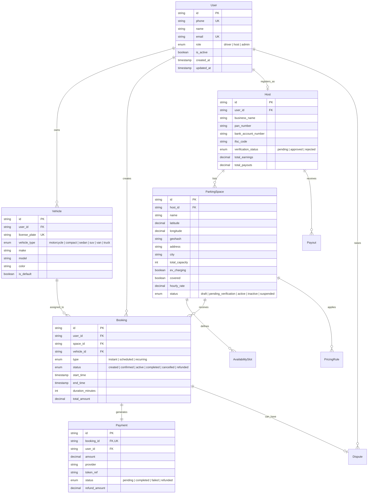

# 🅿️ Parkly — Database Schemas, Data Models & State Machines

> **Document Version**: 1.0.0  
> **Status**: Approved Foundation  
> **Databases**: Amazon RDS PostgreSQL 16 (Relational/ACID) + Amazon DynamoDB (NoSQL/TTL)

---

## 1. Entity-Relationship Diagram (ERD)



---

## 2. PostgreSQL Relational Entities & Attributes

### 2.1 Core Tables Breakdown

#### 1. `users`
* Primary identity table.
* Unique Constraints: `phone` (E.164 format, e.g., `+919876543210`), `email` (nullable).
* Columns: `id` (UUID), `phone`, `name`, `email`, `role` (`driver` | `host` | `admin`), `is_active`, `created_at`, `updated_at`.

#### 2. `vehicles`
* Registered driver vehicles for booking allocation and gate entry verification.
* Unique Constraints: `license_plate` (normalized alphanumeric, e.g., `TN01AB1234`).
* Columns: `id`, `user_id` (FK to `users`), `license_plate`, `vehicle_type` (`motorcycle`, `compact`, `sedan`, `suv`, `van`, `truck`), `make`, `model`, `color`, `is_default`, `created_at`.

#### 3. `hosts`
* Extended profile for property owners monetizing parking spots.
* Columns: `id`, `user_id` (FK to `users`), `business_name`, `pan_number` (tax identification), `bank_account_number`, `ifsc_code`, `verification_status` (`pending`, `approved`, `rejected`), `verified_at`, `total_earnings`, `total_payouts`.

#### 4. `parking_spaces`
* Core inventory table representing physical parking properties.
* Spatial Columns: `latitude`, `longitude` (Decimal degrees), `geohash` (precision 7, ~150m spatial clustering).
* Attributes: `name`, `description`, `address`, `city`, `state`, `pincode`, `region_id`, `total_capacity`, `vehicle_types` (Array of enum), `ev_charging` (Boolean), `covered` (Boolean), `security_level` (`none`, `basic`, `monitored`, `staffed`, `gated`), `cctv`, `lighting`, `attendant`.
* Pricing: `hourly_rate` (Base rate in INR), `dynamic_pricing` (Boolean flag allowing automated surge), `min_booking_hours`, `max_booking_hours`.
* Status: `status` (`draft`, `pending_verification`, `active`, `inactive`, `suspended`).
* Performance Indexes: `@@index([geohash])`, `@@index([city])`, `@@index([status])`.

#### 5. `availability_slots`
* Defines weekly recurring availability windows set by hosts.
* Columns: `id`, `space_id` (FK to `parking_spaces`), `day_of_week` (0=Sunday to 6=Saturday), `start_time` ("08:00"), `end_time` ("18:00").

#### 6. `bookings`
* Core transactional table managing reservations.
* Columns: `id`, `user_id`, `space_id`, `vehicle_id`, `host_id`, `type` (`instant`, `scheduled`, `recurring`), `status` (`created`, `confirmed`, `active`, `completed`, `cancelled`, `refunded`), `start_time`, `end_time`, `duration_minutes`, `recurring_frequency`, `recurring_end_date`, `total_amount`, `currency` ("INR"), `payment_id`, `cancellation_reason`, `cancelled_at`, `completed_at`, `created_at`.
* Performance Indexes: `@@index([userId])`, `@@index([spaceId])`, `@@index([status])`, `@@index([startTime, endTime])`.

#### 7. `payments` & `payouts`
* `payments`: Records every payment attempt, gateway transaction ID, payment token reference, and refund records. Never stores raw card or bank account credentials.
* `payouts`: Tracks platform host balance settlements minus platform commission (e.g. 15%–20%).

#### 8. `pricing_rules`
* Custom or global surge rules (e.g., peak rush 08:00–10:00 multiplier 1.25x; weekend evening multiplier 1.30x).

#### 9. `disputes`
* Audited dispute resolution between driver and host (e.g., `no_show`, `unauthorized_use`, `blocked_driveway`).

---

## 3. DynamoDB Table Schemas

### 3.1 `parkly-otp-verifications`
* **Partition Key (PK)**: `phone` (String, e.g. `+919876543210`)
* **Attributes**: `otpHash` (String, SHA-256 salted hash), `attempts` (Number), `expiresAt` (Number, UNIX epoch), `ttl` (Number, DynamoDB native TTL auto-delete timestamp).

### 3.2 `parkly-occupancy-timeseries`
* **Partition Key (PK)**: `spaceId` (String)
* **Sort Key (SK)**: `timestamp` (String, ISO 8601, e.g. `2026-09-05T09:30:00.000Z`)
* **Attributes**: `occupiedSlots` (Number), `totalSlots` (Number), `occupancyPercentage` (Number), `source` (`sensor` | `qr_checkin` | `manual_host`), `vehiclePlate` (Optional String).

### 3.3 `parkly-notifications`
* **Partition Key (PK)**: `id` (String UUID)
* **Global Secondary Index (GSI)**:
  - **GSI PK**: `userId`
  - **GSI SK**: `createdAt` (Descending)
* **Attributes**: `title`, `body`, `type` (`booking_confirmed`, `payout_sent`, `space_approved`), `isRead` (Boolean), `metadata` (JSON Map).

---

## 4. State Machines & Lifecycle Transitions

### 4.1 Booking Lifecycle State Machine

```
               ┌─────────────┐
               │   CREATED   │ ──(Payment Timeout 10m)──► ┌─────────────┐
               └──────┬──────┘                           │  CANCELLED  │
                      │ (Payment Succeeded)              └─────────────┘
                      ▼                                         ▲
               ┌─────────────┐                                  │
               │  CONFIRMED  │ ──(User/Host Cancels Before)─────┘
               └──────┬──────┘
                      │ (Check-in via QR / Time Reached)
                      ▼
               ┌─────────────┐
               │   ACTIVE    │
               └──────┬──────┘
                      │ (Check-out via QR / Time Concluded)
                      ▼
               ┌─────────────┐
               │  COMPLETED  │ ──(Host Payout Triggered)
               └─────────────┘
```

### 4.2 Concurrency & Double-Booking Prevention Protocol
To guarantee that two drivers cannot reserve the same slot during overlapping intervals:
1. When booking creation is requested, an explicit database transaction is opened in PostgreSQL.
2. A conditional overlap query executes:
   ```sql
   SELECT COUNT(*) FROM bookings
   WHERE space_id = :spaceId
     AND status IN ('created', 'confirmed', 'active')
     AND start_time < :requestedEndTime
     AND end_time > :requestedStartTime
   FOR UPDATE;
   ```
3. If active overlapping bookings equal or exceed `total_capacity`, the transaction aborts immediately with a `ConcurrencyConflictError` (HTTP 409).
4. The provisional booking is held with a status of `created` and a 10-minute expiry window. If payment is not completed within 10 minutes, an automated worker marks the booking `cancelled`, releasing the slot.
